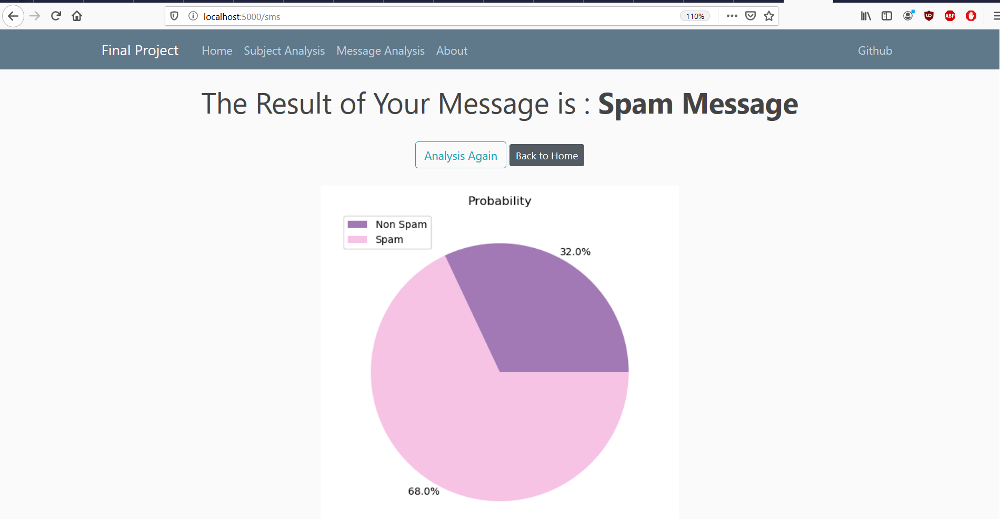
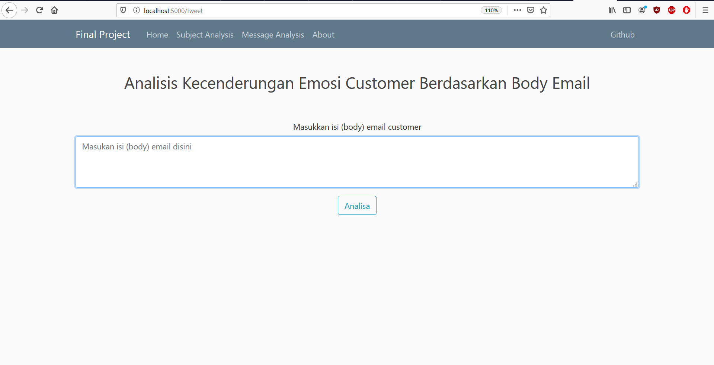
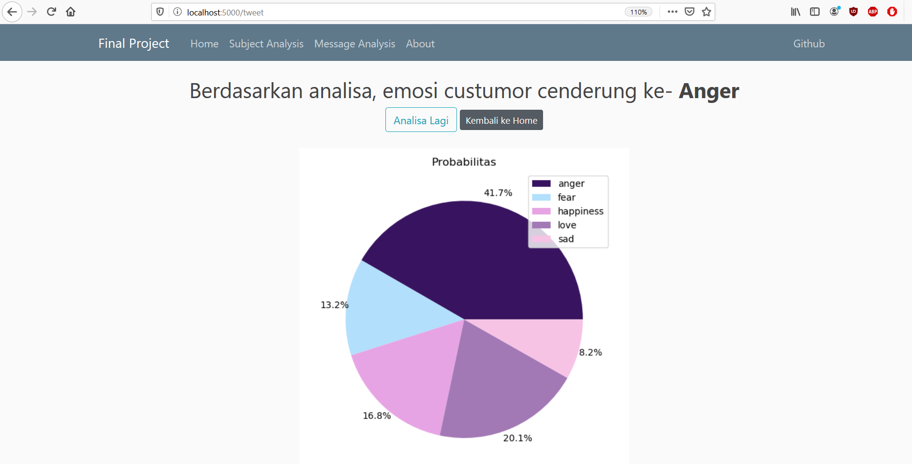
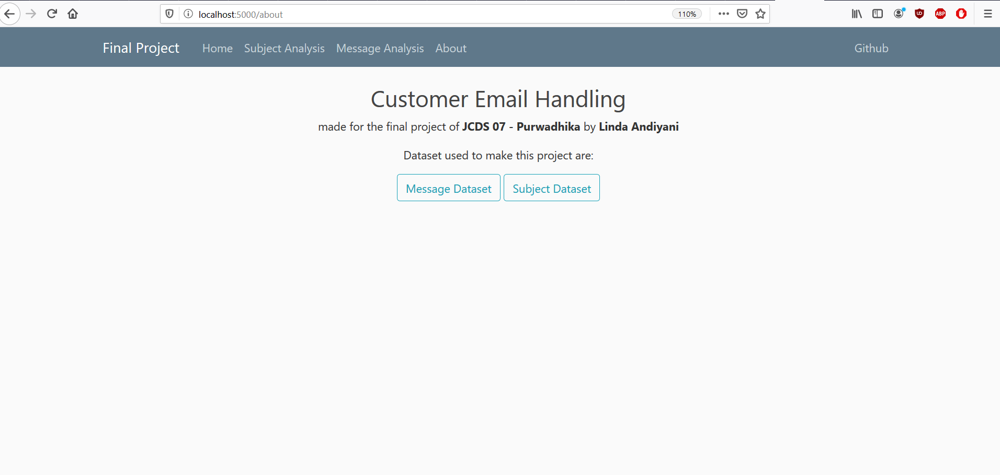

# Purwadhika Job Connector Data Science - Final Project #

## SPAM and Tweet Emotion Analysis with NLP ##

This repository contain the final project as one of the requirements to fullfill in [Purwadhika](https://purwadhika.com/jc-data-science) Job Connector - Data Science Program. Theme of this project is to create local web and using [Natural Language Processing](https://en.wikipedia.org/wiki/Natural_language_processing) procedures to create app that can classify [SMS](https://en.wikipedia.org/wiki/SMS) as SPAM, or HAM(no SPAM) and also app that can classify the emotion (happy, angry, sad, fear, love) from tweet from [Twitter](https://twitter.com/).  
Dataset used to make this project are:

1. [Spam Filter Dataset](https://www.kaggle.com/team-ai/spam-text-message-classification).

2. [Emotion Analysis Dataset](http://nlp.yuliadi.pro/dataset).

The python libraries used to make this project are:

- pandas
- numpy
- matplotlib
- seaborn
- io
- os
- WordCloud
- base64
- sastrawi
- nltk
- string
- scikit-learn
- joblib

Several machine learning are used and compared to evaluate the model. From model evaluation, the **machine learning** algorithms I used for model for this app are:

- Random Forest Classifier - [RandoForest](https://scikit-learn.org/stable/modules/generated/sklearn.ensemble.RandomForestClassifier.html) for SPAM filtering app.

- Multinomial Naive Bayes - [MultinomialNB](https://scikit-learn.org/stable/modules/generated/sklearn.naive_bayes.MultinomialNB.html) for body email emotion detection app.

The components for this web app can be summarized as several section:

1. **Homepage**  

2. **SPAM Message Classification**  
  
  

3. **Emotion Analysis**  
  
  

4. **About Page**  

Thats all for this final project, feel free to **suggest** to **email below** and let me know how can this project make working even better.

### Linda Andiyani | _Lindaandiyani@gmail.com_ ###
